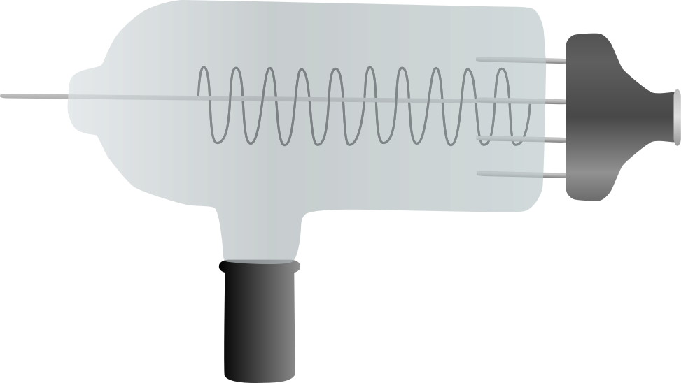
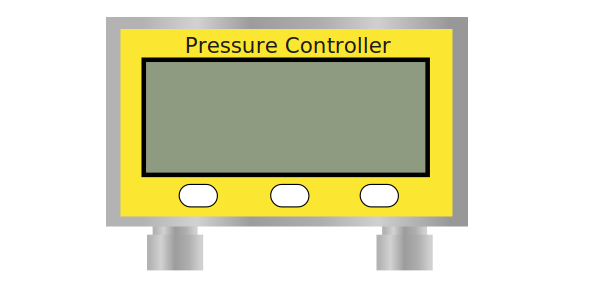

# FTMW Scientific Instrument Simulator

## Table of contents

* [Overview](#overview)
* [Development History](#development-history)
* [Student Team](#student-team)

## Overview
In response to the challenges faced in conducting experiments during the COVID-19 pandemic, the Raston Lab initiated the development of virtual scientific instruments to ensure accessible education for students worldwide. Building on the success of their Fourier Transform InfraRed (FTIR) Spectroscopy Simulator, their new project for Spring 2025 focuses on creating a Fourier Transform Microwave (FTMW) Spectroscopy Simulator. Unlike infraRed spectroscopy, FTMW operates in the microwave range and involves entirely different electronic components and principles. This simulator will provide students with a user-friendly platform to perform microwave spectroscopy experiments on any device. This eliminates the need for costly physical instruments and ensures that education can continue even in the event of another pandemic.

## Milestone 1: 

### Setup Window

The purpose of this window is to configure the spectrometer parameters. It uses the [Redux Toolkit](https://github.com/reduxjs/redux-toolkit) to store the applied values into the redux store.

### Menu Items

Changed the Menu Items to be more accurate with the FTMW spectrometer.

### Instrument Window SVG Components
All of these components were made using [Inkscape](https://inkscape.org/release/inkscape-1.4/). These will all be put together into one SVG file for the Instrument Window

**- Ion Gauge**

**- Mirror**

**- Pressure Controller**

**- Tuning Rod and Motor**

## Student Team

Shedrick Ulibas and Weibin Wu
